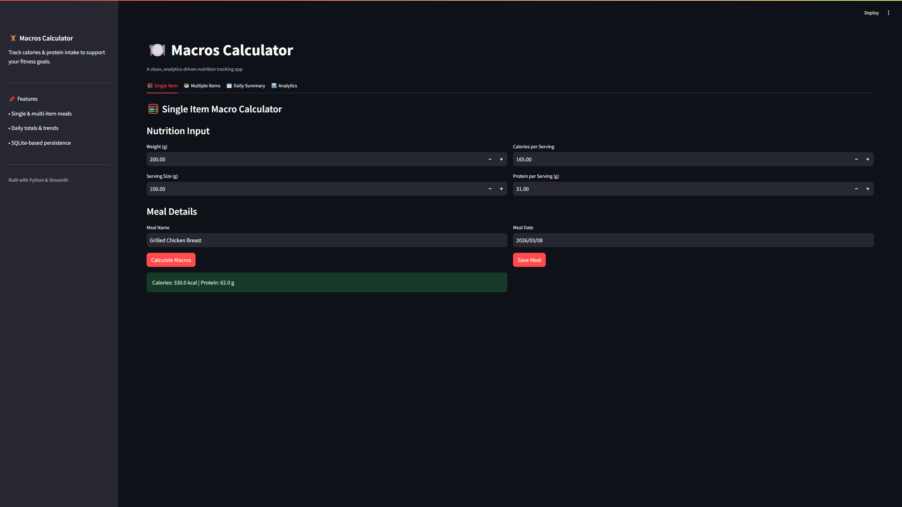
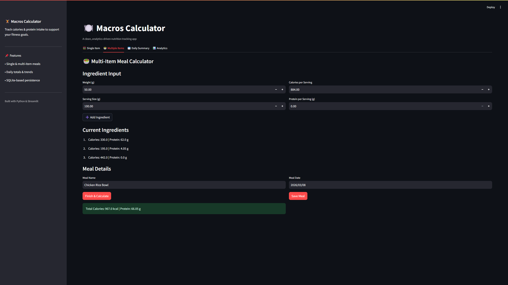
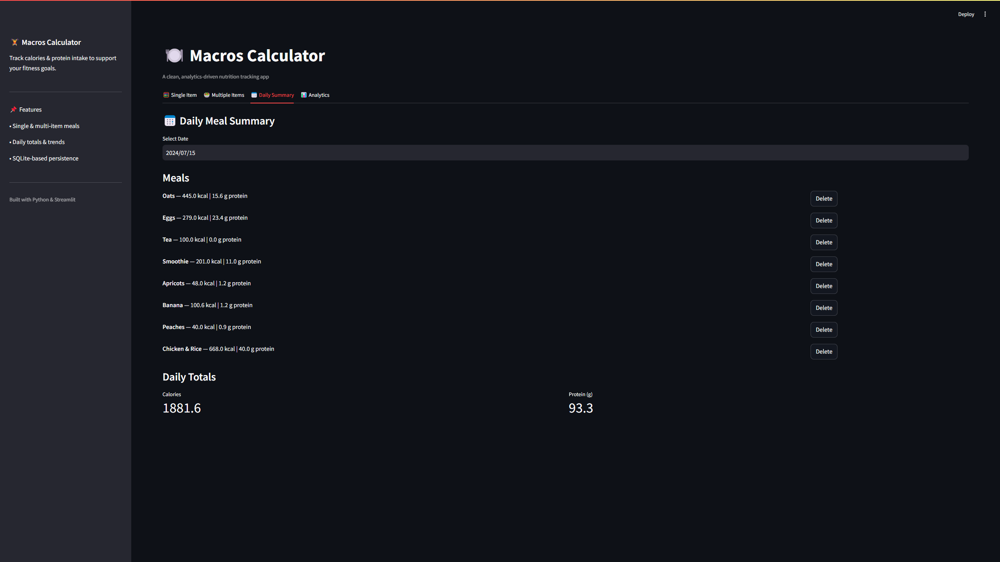
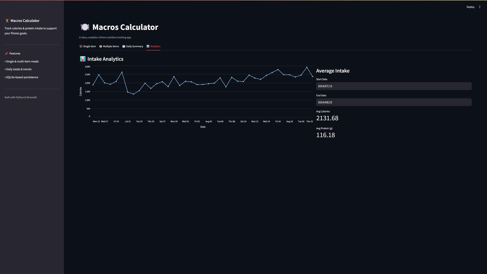

# 🍽️ Macros Calculator


A **Python + Streamlit nutrition tracking app** that calculates calories and protein for meals, stores them in a SQLite database, and visualizes nutrition trends over time.

This project allows users to track meals, calculate macros based on serving sizes, and analyze their calorie intake using an interactive dashboard.

---

# 🚀 Live Demo

Try the deployed application here:

https://macros-calculator.streamlit.app/

---

# ✨ Features

### 🧮 Macro Calculation
- Calculate macros for **single food items**
- Calculate macros for **multi-ingredient meals**
- Automatic calorie and protein calculation using serving size

### 🥗 Meal Tracking
- Save meals with a **name and date**
- Store meals in a **SQLite database**
- View meals for a specific day
- Delete meals from the tracker

### 📅 Daily Summary
- Display meals recorded for a selected date
- Automatically calculate **daily total calories and protein**

### 📊 Analytics Dashboard
- Visualize **calorie trends over time**
- Compute **average calorie and protein intake between dates**

### 💾 Data Storage
- Uses **SQLite** for persistent local storage
- Lightweight database design

---

# 🧰 Tech Stack

- **Python**
- **Streamlit** – web application framework
- **SQLite** – lightweight local database
- **Pandas** – data processing
- **Altair** – data visualization

---

# 📦 Installation

Clone the repository:

```bash
git clone https://github.com/Abdulla1x/Macros-Calculator.git
cd Macros-Calculator
```

Create a virtual environment (recommended):

```bash
python -m venv venv
```

Activate the environment:

Windows:

```bash
venv\Scripts\activate
```

Install dependencies:

```bash
pip install -r requirements.txt
```

---

# ▶️ Running the App

Run the Streamlit application:

```bash
streamlit run streamlitApp.py
```

The app will open in your browser:

```
http://localhost:8501
```

---

# 📂 Project Structure

```
Macros-Calculator
│
├── streamlitApp.py          # Main Streamlit UI
├── macros_calculator.py     # Calculation logic and database functions
├── migration_script.py      # Script to migrate legacy meal data
├── macros.db                # SQLite database (ignored by Git)
├── requirements.txt         # Python dependencies
├── .gitignore               # Git ignore rules
└── README.md
```

---

# 📸 Screenshots

### Single Item Calculator


### Multi Ingredient Meal


### Daily Meal Summary


### Analytics Dashboard


---

# 🔄 Legacy Data Migration

If meals were previously stored in `Meal_Data.txt`, they can be migrated into the SQLite database using:

```bash
python migration_script.py
```

This script converts the legacy meal data into the new database format.

---

# 📈 Future Improvements

Possible future enhancements:

- Edit or update saved meals
- Export meals to CSV
- Add additional macros (carbs, fats)
- Add nutrition goals tracking
- Add unit tests
- Improve analytics and visualizations
- Support cloud databases

---

# 👨‍💻 Author

**Abdulla**

GitHub:  
https://github.com/Abdulla1x
